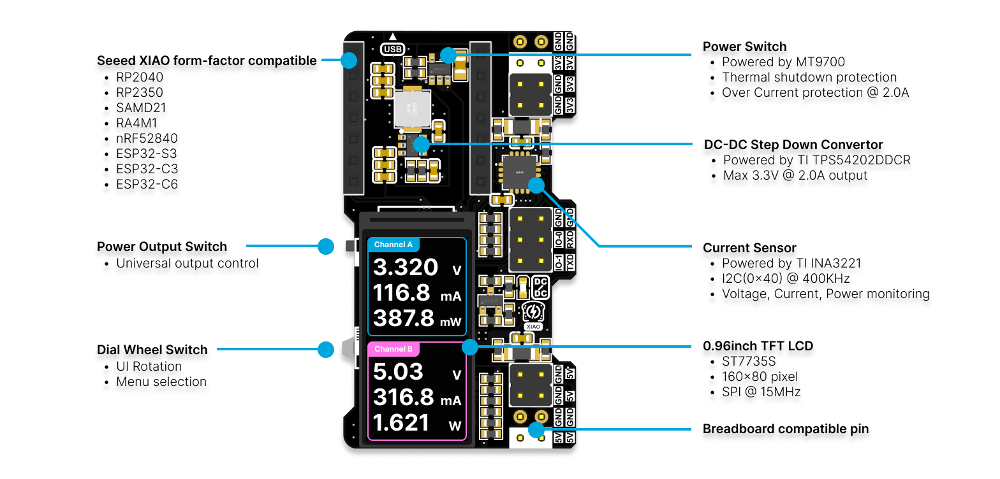

# XIAO PowerBread

XIAO PowerBread is an open-source hardware project designed to provide a versatile and efficient power solution for breadboard prototyping. With built-in sensors, real-time monitoring, and the power of the RP2040 microcontroller, XIAO PowerBread simplifies the development of electronics projects.

## Key Features

1. **Real-Time Monitoring**: Direct monitoring, no multimeter needed – easily see what’s powering your project in real time.
2. **High-Current Output**: Power your breadboard with confidence – up to 1.5A of steady 3.3V output!
3. **Built-in LCD Display**: Instant feedback at a glance – real-time voltage, current, and power displayed in one place.
4. **Plug-and-Play Design**: Plug in, power up, and go – breadboard-friendly and ready to work.
5. **Open-Source and RP2040 Powered**: Flexible, open-source, and RP2040-powered – ready to grow with your projects.
6. **Dual-Channel Volatge and Current Sensor**: Monitor every detail – Dual sensing gives you the full picture.
7. **Compact Powerhouse**: Small form, big power – optimize your breadboard setup with 3.3V and 5V outputs.

## Hardware Specifications
- **Input Voltage**: USB-C input by XIAO.
- **Output Voltages**: Provides both 5V and 3.3V, with a maximum 3.3V output current of 1.5A.
- **Current Sensing**: Uses the INA3221 sensor for real-time voltage, current, and power measurement.
- **Microcontroller**: Powered by the RP2040, driving the current sensor and LCD, also enabling future extensions such as USB-serial communication and PWM output.
- **Display**: LCD for displaying real-time power statistics.
- **PCB Dimensions**: Designed for breadboard integration with minimal space usage.

## Getting Started

### Hardware

- **XIAO Board**: Recommend to use XIAO RP2040 or you can try other type of XIAO, it should be good.
- **XIAO Powerbread Board**: You can make a clone or remix based the this repo. (Maybe on tindie someday if neccerssy.)
- **Breadboard**: The PowerBread is designed to fit standard breadboards.
- **Power Supply**: Use regular USB power source.

### Software

- **Arduino Code**: If you want to remix or modify, please refer to the arduin source code.
- **Bin file**: If you planing to use XIAO RP2040, you can directly download the bin file and flash it via UF2.

#### Software feature dev plan
- [x] Read Current sensor data and display on LCD at real-time
- [x] Use dial wheel switch to roate the UI on LCD to fit different viewing angle.
- [ ] Auto-switch measuring range from uA -> mA -> A
- [ ] Line chart mode for each power channel
- [ ] USB to Serial mode
- [ ] PWM output on IO0 and IO1
- [ ] ADC reading on IO0 and IO1

### Usage

1. **Power the Board**:
   Connect the PowerBread to USB or an external power source.

2. **Real-Time Monitoring**:
   View real-time voltage, current, and power consumption on the LCD display for two channels.

3. **Extend Functionality**:
   In future updates, you can use the RP2040 for additional functions like USB-serial communication or PWM generation.

## Contributing

We welcome contributions to enhance the XIAO PowerBread project! Feel free to submit pull requests, suggest new features, or report bugs via the issue tracker.

## License

This project is licensed under the MIT License - see the [LICENSE](./LICENSE) file for details.

---

Feel free to edit further based on additional functionality or details.

